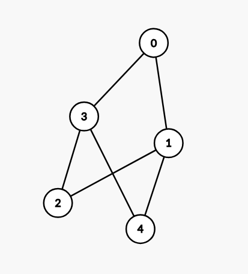
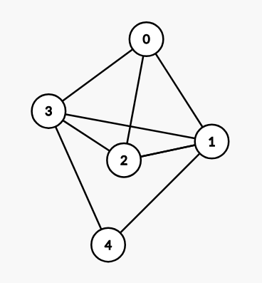
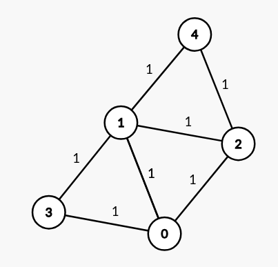
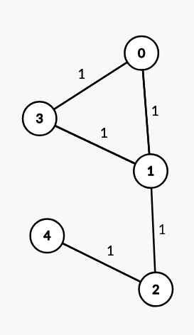
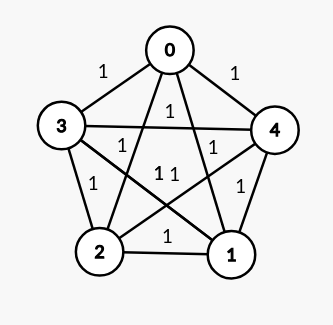

# HW 6 - Cougar Bellinger

### 1)
Depth-first search

### 2)
The DFS would start at the root node, then travese completely to the left, keeping a stack of nodes it has visited. Because the tree is ordered in alphabetical order for the set of words from left to right, this would be a great starting point to come up with an algorithm to organize the list by alphabet.

### 3)
Breadth first search 

### 4)

### 5)

### 6)

### 7)

### 8)
